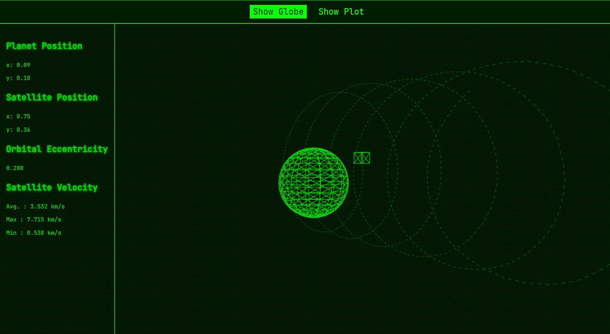

In tackling this mini-project, I aimed to show the creative problem-solving and technical skills required for the position. This project was more than creating something functional; it was about developing a standout solution with a touch of innovation. It turned into a display of my strengths, prioritizing creative thinking and fresh approaches over the usual methods.

## Start

`docker-compose up --build`

## Initial Setup

#### TypeScript & SCSS Integration

I added TypeScript support for static typing and a better dev experience and QoL.

#### Web Vitals

Utilized the `reportWebVitals` function to log the data to the console and formatted the logs for readability.

#### Testing

I added some basic tests with jest and implemented a quality gate to run them automatically before starting the serve:

- Rendering the Globe initially
- Switching to Plot
- Ensuring smooth transitions and accurate data display

## Simulator

#### Q-Range KV Store Data Structure

Refined the Q-Range KV Store to map left-inclusive, right-exclusive ranges to values, enhancing query efficiency and error handling. The updated structure validates range inputs to avoid logical inconsistencies and streamlines data fetching with concise code, optimizing for quick retrieval and improved maintainability.

```python
store = QRangeStore()
store[0, 3] = 'Record A'
store[2, 4] = 'Record D'
# Example query
print(store[2.1])  # ['Record A', 'Record D']
```

#### Is it faster?

I think so...? I didn't have time to benchmark it, but it does feel a little faster, and in theory it should.

## Frontend

I had a lot of fun with this one. I knew I needed to render the data in 3D the moment I opened the project and saw the graph. So I opted for Three.js to visualize the planet and satellite in real time. you can zoom, rotate, making the experience more intuitive and interactive.

#### Why Three.js?

Three.js was the natural choice to bring the orbital paths into an interactive 3D space. While it’s not something I'd usually do outside of marketing contexts, I embraced the chance to make something both fun and technically intriguing.

#### Visuals

For the theme, since I didn’t have the resources and assets for a full render of the planet, I went with a retro radar command prompt style, inspired by the Pip-Boy from the Fallout games. It was a practical choice that also gave the interface a cool, old-school vibe.

#### What it Does

- Utilizes OrbitControls Three.JS API for 3D rendering.
- Dynamically visualizes satellite orbits and planetary movements.
- Integrates real-time simulation data for accurate representation.
- Includes orbital eccentricity and velocity statistics within the interface.
- Smooth animations enhance user experience.
- Trajectory displays for detailed analysis. **_Note:_** Sometimes when the loop ends, you may notice the trajectory abruptly derail to the initial position. This happens because when the loop ends, the satellite is sent back to its starting position. This wouldn't occur in a true space simulation, but it's worth noting here.

## Statistical Analysis of Satellite Data

I performed statistical analysis on satellite simulation data on the frontend for convenience and quick feedback. This approach allows real-time interaction and instant visualization of orbital dynamics.

#### Orbital Eccentricity

I created a component to calculate orbital eccentricity(\(e = \frac{r_a - r_p}{r_a + r_p}\)) to directly assess the orbit's shape (did some googling) to ensure accuracy and relevance in aerospace studies.

#### Velocity Statistics

Developed a component that scales velocity statistics to realistic orbital velocities, aligning with typical satellite behavior. This scaling is based on the max observed simulation velocity (0.145) to a typical LEO velocity ~7.8 km/s (per my google search again).


